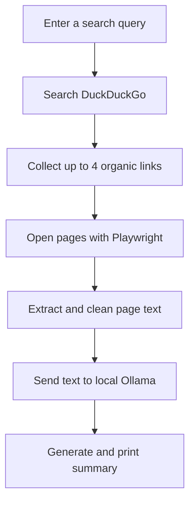

<div align="center">

# WebSum

### AI-Powered Web Research, Summarized Locally

**Search the web. Extract useful content. Generate a source-informed summary with your local Ollama model.**

<br>


<br>

[Features](#-features) · [How It Works](#-how-it-works) · [Installation](#-installation) · [Configuration](#-configuration) · [Limitations](#-limitations)

</div>

---

## 🔎 Overview

**WebSum** is a Python-based web research assistant that searches DuckDuckGo, extracts readable text from selected search results using Playwright, and asks a locally running [Ollama](https://ollama.com/) model to summarize the collected information.

The goal is to make it easier to review information across several pages without manually opening and reading every result.

> **Privacy-minded by design:** the summarization request is sent to your local Ollama API. Web search and website visits still connect to external services.

## ✨ Features

| Feature | Description |
|---|---|
| 🌐 Web search | Searches DuckDuckGo for your query |
| 🔗 Result collection | Collects up to four unique organic result links |
| 🧭 Browser automation | Uses Playwright with Chromium to open result pages |
| 🧹 Text extraction | Removes common page elements before collecting readable text |
| 🧠 Local AI summary | Sends the collected text to a local Ollama model |
| 🗂️ Multi-source analysis | Prompts the model to summarize findings and compare sources |
| 📏 Text limits | Caps text collected per site and across all sources |
| 🖥️ Visible browser | Shows Chromium by default so you can observe the workflow |

## ⚙️ How It Works



1. Enter a search query in the terminal.
2. WebSum searches DuckDuckGo.
3. It collects up to four unique organic result links.
4. Playwright opens each page and extracts readable text.
5. The extracted text is sent to the local Ollama API.
6. The model generates a summary, which is printed in the terminal.

## 🧰 Tech Stack

<div align="center">


</div>

## 📋 Requirements

- **Python 3.10 or newer**
- [Ollama](https://ollama.com/) installed and running locally
- The `qwen3.5:9b` model available in Ollama
- Playwright with Chromium installed

## 🚀 Installation

### 1. Clone the repository

```bash
git clone https://github.com/arjunsinha26/websum.git
cd websum
```

### 2. Install Python dependencies

```bash
python -m pip install playwright aiohttp
```

### 3. Install Chromium for Playwright

```bash
python -m playwright install chromium
```

### 4. Download the Ollama model

```bash
ollama pull qwen3.5:9b
```

Start Ollama and make sure its local API is available at:

```text
http://127.0.0.1:11434
```

## ▶️ Usage

Run WebSum from the project directory:

```bash
python main.py
```

Enter your search query when prompted. The script will search, scrape the selected pages, and print the model-generated summary.

## 🎛️ Configuration

The current implementation keeps its settings as constants near the top of `main.py`.

| Setting | Default | Purpose |
|---|---:|---|
| `URL` | DuckDuckGo search URL | Search endpoint |
| `OLLAMA_URL` | `http://127.0.0.1:11434/api/generate` | Local Ollama generation endpoint |
| `OLLAMA_MODEL` | `qwen3.5:9b` | Model used for summarization |
| `MAX_LINKS` | `4` | Maximum number of result links |
| `MAX_CHARS_PER_SITE` | `10000` | Maximum characters collected from one page |
| `MAX_TOTAL_CHARS` | `30000` | Maximum combined source text sent for analysis |

Change these constants in `main.py` to adjust the current configuration.

### 🖥️ Show or hide Chromium

The script launches Chromium with `headless=False` by default, so the browser window is visible.

To run without displaying the browser, change the launch option to:

```python
headless=True
```

The existing launch arguments are Chromium-specific. If you switch to Firefox or WebKit, review the launch options first.

## 📁 Project Structure

```text
websum/
├── main.py       # Main search, scraping, and summarization workflow
└── README.md     # Project documentation
```

## ⚠️ Limitations

- **Limited search coverage:** only the first four unique organic results are collected by default.
- **Blocked websites:** some sites may block automated browsing or require consent, verification, or other interactions.
- **Extraction quality:** complex pages may produce incomplete or irrelevant text.
- **Context window:** characters are not tokens. The combined text and prompt may exceed the model's available context, depending on tokenization and model settings.
- **Summary accuracy:** summaries depend on the pages successfully scraped and the model's interpretation. Check important claims against the original sources.
- **Local performance:** generation speed depends on your hardware and the selected Ollama model.

## 🛠️ Troubleshooting

<details>
<summary><strong>Ollama connection error</strong></summary>

1. Make sure Ollama is installed and running.
2. Check that `http://127.0.0.1:11434` is reachable locally.
3. Confirm the model is available:

   ```bash
   ollama list
   ```

4. Download it if necessary:

   ```bash
   ollama pull qwen3.5:9b
   ```

</details>

<details>
<summary><strong>Playwright cannot find Chromium</strong></summary>

Run:

```bash
python -m playwright install chromium
```

</details>

<details>
<summary><strong>A website returns little or no text</strong></summary>

The site may block automated access, require interaction, or render content in a way the current scraper does not capture. Check the visible browser for redirects, consent prompts, or verification pages.

</details>

<details>
<summary><strong>Ollama reports a context-length error</strong></summary>

Reduce `MAX_CHARS_PER_SITE` or `MAX_TOTAL_CHARS` in `main.py`. The prompt, source text, and generated response must all fit within the model's context window.

</details>

## 🔐 Responsible Use

Use WebSum only on websites you are permitted to access. Respect site terms, applicable robots directives, copyright, and rate limits. Do not use it to bypass access controls or collect private information.

## 📄 License

No license is currently specified in the repository. If you intend to publish WebSum as open source, add a `LICENSE` file and choose a license that matches how you want others to use the project. For example, the MIT License permits broad reuse while requiring the copyright and license notice to be retained.

## 🤝 Contributing

Bug reports, ideas, and improvements are welcome. For substantial changes, open an issue first to discuss the proposed approach.

---

<div align="center">

**Built with Python, Playwright, and local AI.**

<sub>If WebSum is useful to you, consider giving the repository a ⭐ on GitHub.</sub>

</div>
